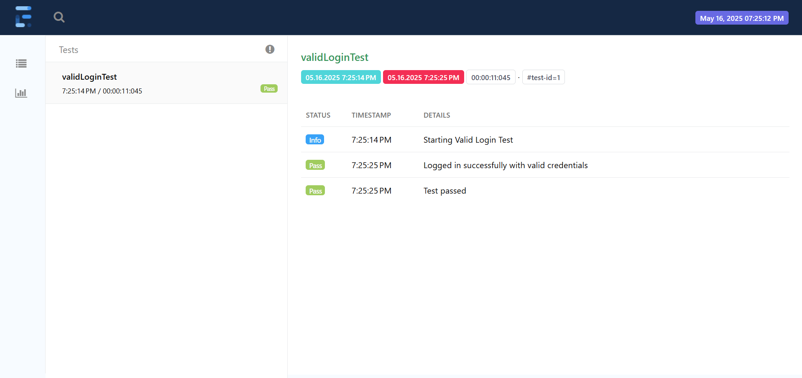
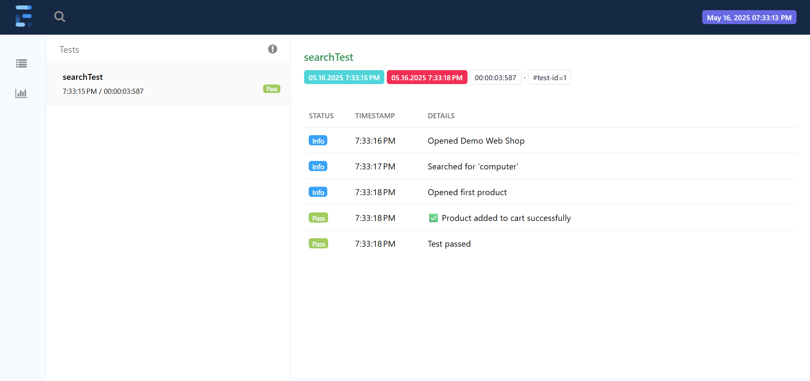
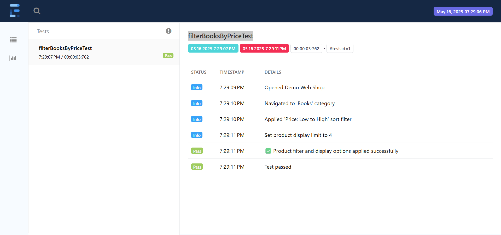
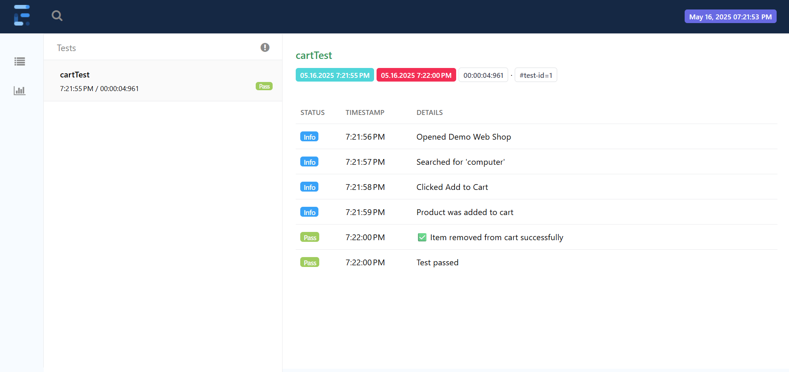
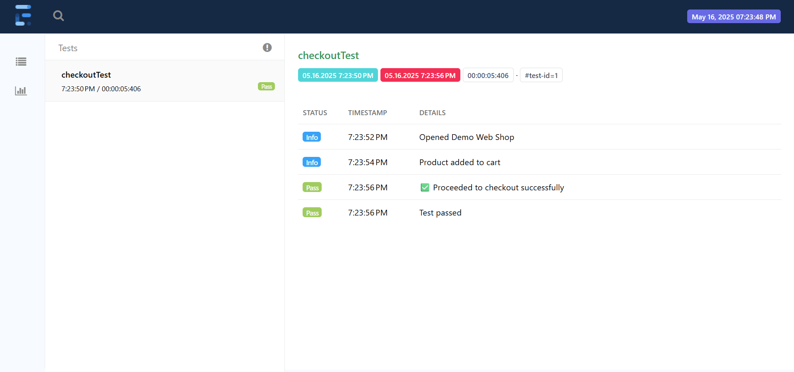
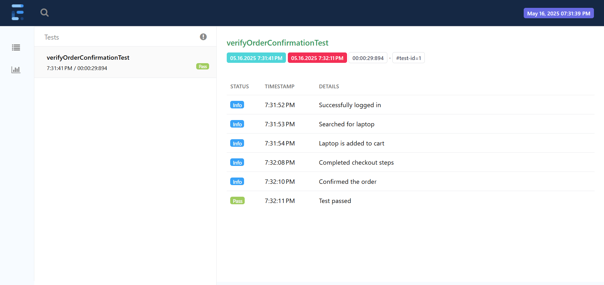

# Selenium Automation Framework - E-Commerce Test Suite

## 📌 Overview

This project is a Selenium WebDriver test automation suite written in Java to validate the core functionalities of an e-commerce website: [https://demowebshop.tricentis.com](https://demowebshop.tricentis.com).

### 🧪 Covered Test Cases

- ✅ Valid and invalid login
- 🔍 Product search
- 🛒 Add to cart and remove from cart
- 💳 Checkout flow
- 🧾 Order confirmation verification

### 🧱 Project Structure

├── Pages/ # Page Object Model (POM) classes

├── Tests/ # TestNG test classes

├── Utils/ # WebDriver setup and utility methods

├── testng.xml # TestNG suite configuration

└── README.md # This file

## ⚙️ Setup Instructions

### ✅ Prerequisites

- Java JDK 17 or higher
- Maven or IntelliJ IDEA with Maven support
- Google Chrome browser
- ChromeDriver matching your browser version
- Internet connection to access the test site

---

### 📦 Installation Steps

1. **Clone the Repository**
   ```bash
   git clone https://github.com/omara03/Software_Verification_Validation
   cd Software_Verification_Validation


validLoginTest


invalidLoginTest


searchTest


productFilterTest


cartTest


checkoutTest


verifyOrderConfirmationTest
